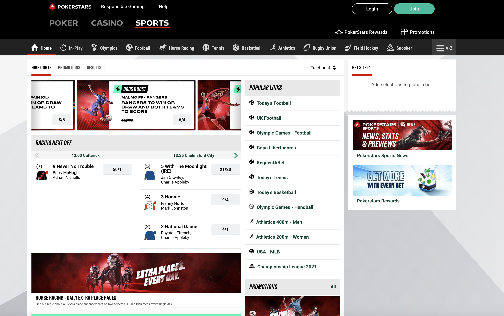
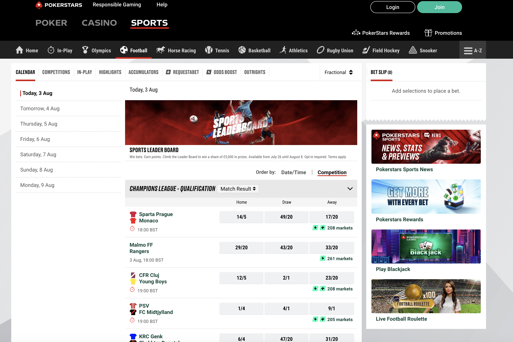
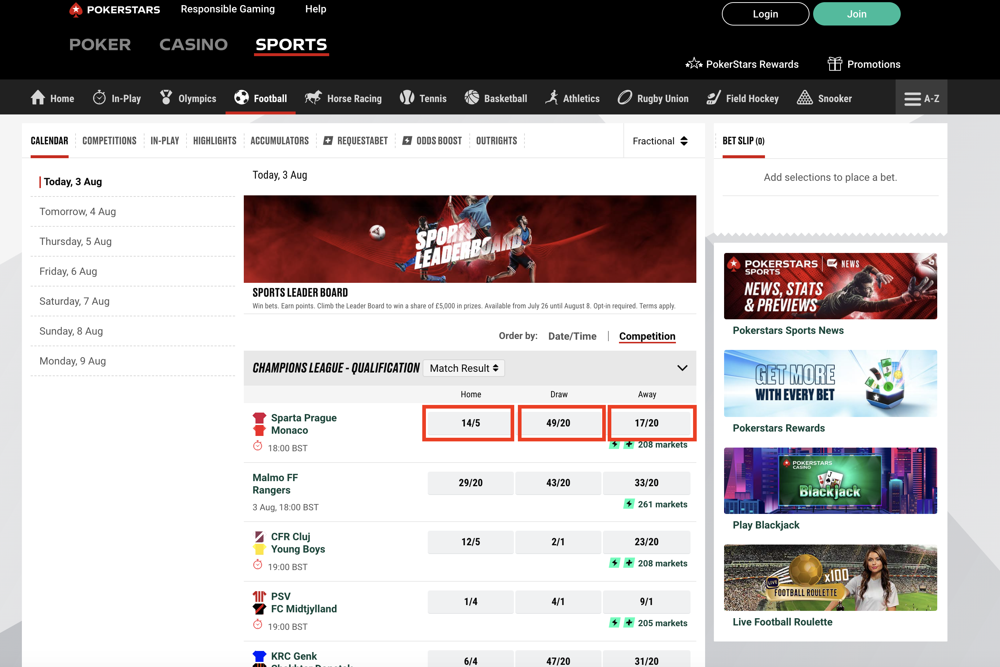
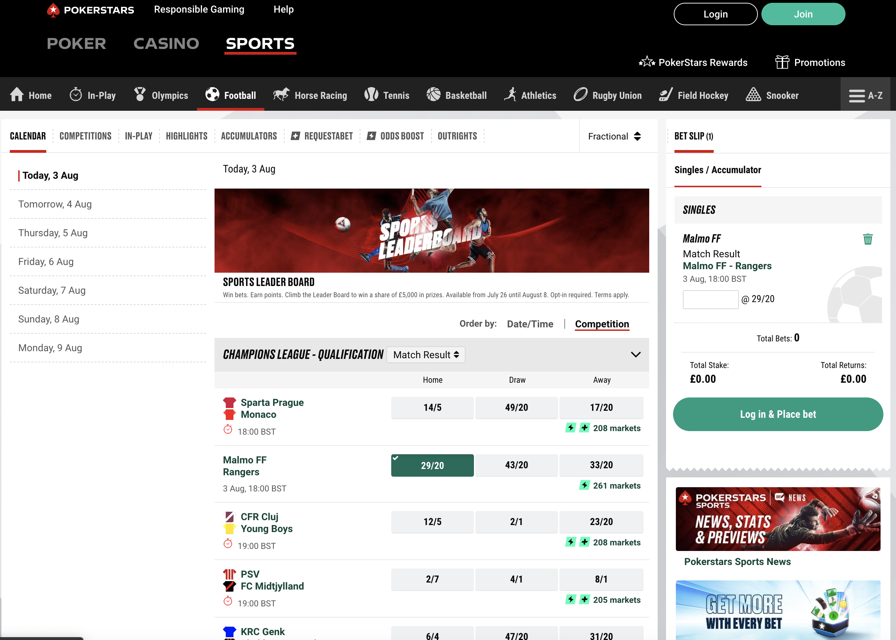

# PokerStars - ISP Tribe
## SEiT Performance Test Assessment

This test is against our Live PokerStars website.

The challenge is to build a Performance Test framework that can be pointed at multiple test environments.

### The Test

We realise that everyone has different levels of skills and experience when it comes to development, 
and so if you do not have the time or knowledge to complete all tasks, that's okay, 
we just want to see how you would approach the problem and get a feel for how your code.
When you are testing the framework, please run your tests with no more than 5 virtual users/threads 

### Languages
This is a performance testing focused tech test, so the end deliverable should be a test framework with various configurations to vary the load  
against multiple Test environments. 

Most of our performance test frameworks are OpenSource and test at the HTTP protocol level rather than browser based. 
The scripts are built and maintained by both Developers and Test Engineers in source control like git.They get executed in CI/CD pipelines against multiple envrionments 
You may use any OpenSource tool you like that provides a code/script driven framework as opposed to record and playback. 

### Review Criteria
At a high level we will be looking for:

* Clear instructions for how to set up and run the framework on a reviewer's machine
* Good understanding of the tasks undertaken
* Well-structured and concise code
* Use of relevant design patterns
* Good understanding of parametrisation and configurations to change the load against multiple environments

### Submission
Please upload your completed test to a publicly-accessible repository in a hosting service (e.g. GitHub), 
and send a link to your recruitment contact.

## Tasks

Using our Live website https://www.pokerstarssports.uk/ to build a script that simulates the following:

1. Navigation journey.
    1. Navigate to Home Page - https://www.pokerstarssports.uk/
       
    1. Navigate to the Football Page 
        
    1. Randomly pick any match and one of the odds (Home, Draw, Away) on that page. 
       
    1. Simulate the 'click on one of the odds' which will bring that odds to `Bet Slip`
       
    1. Assert that the Betslip is populated with the randomly selected odds.
1. Parameterisation of the above journey to target different Environment. 
    1. Assume there are two Environments - Live and Perf. 
    1. Design the framework for passing environment as a run time argument. 
    1. Design the framework for passing a run time argument to add dynamism in load. for example number of Virtual Users or threads or throughput target for a specific duration say 15 minutes or 30 minutes
